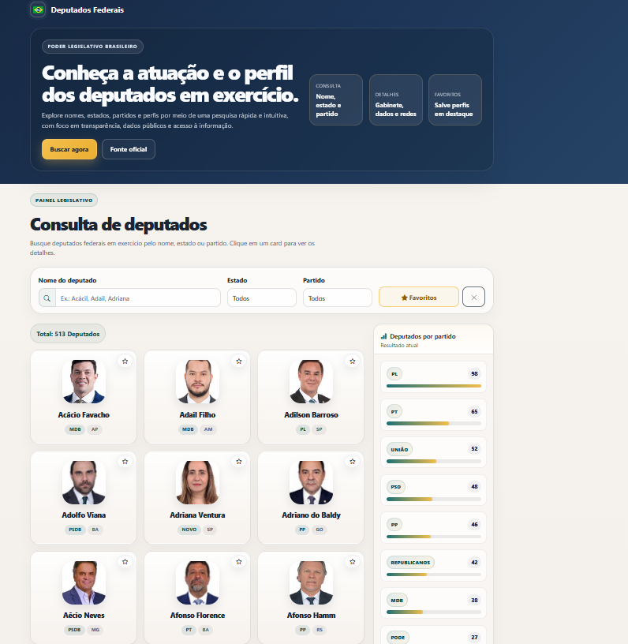
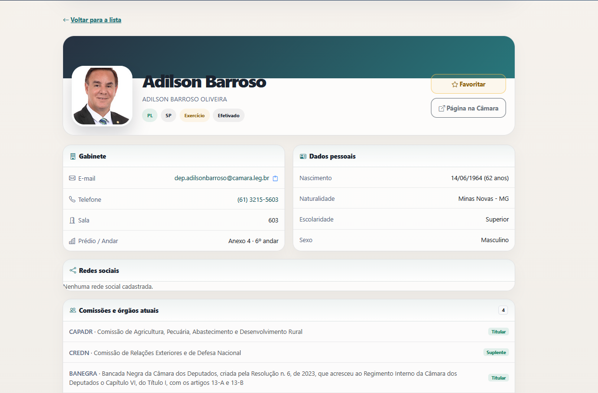

# Deputados Federais

Aplicação web para consultar deputados federais, com busca por nome, filtros por estado e partido, favoritos e detalhes completos de cada parlamentar.

## Sobre o projeto

Este projeto consome a API pública da Câmara dos Deputados para exibir informações como:
- foto
- nome e partido
- UF
- dados pessoais
- gabinete
- redes sociais
- comissões e órgãos

A interface foi pensada para ser simples, responsiva e fácil de navegar.

## Tecnologias

- Vue 3
- Vite
- Vue Router
- Axios
- Bootstrap 5
- Bootstrap Icons

## Funcionalidades

- Busca por nome de deputado
- Filtro por estado
- Filtro por partido
- Visualização de favoritos
- Página de detalhes do deputado
- Ranking por partido
- Visualização de redes sociais e contatos
- Layout responsivo

## Como rodar

Pré-requisito:
- Node.js 22.18+ ou 24.12+

No terminal, dentro da pasta do projeto:

```bash
npm install
npm run dev
```

Depois abra o endereço que aparecer no terminal, normalmente:

```bash
http://localhost:4175
```

Para gerar a versão de produção:

```bash
npm run build
npm run preview
```

## Estrutura principal

```text
src/
├── components/
├── router/
├── services/
├── utils/
├── views/
├── App.vue
├── main.js
└── assets/
```

## Visualização

### Listagem de deputados



### Detalhes do deputado



## Observação

O projeto usa a API de Dados Abertos da Câmara e foi pensado para facilitar a consulta de informações públicas de forma visual e direta.
